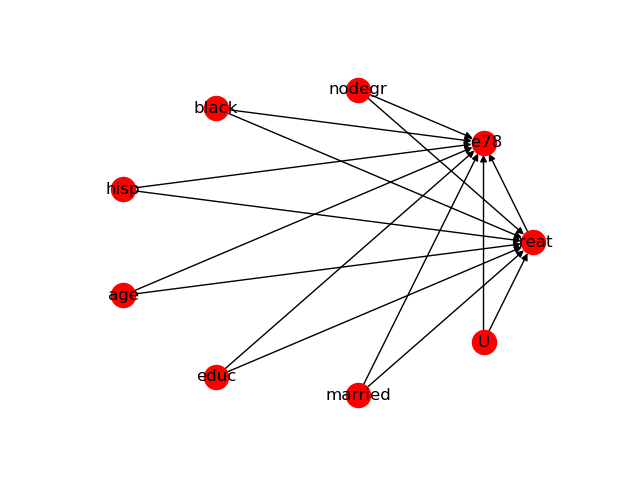

DoWhy | Making causal inference easy
====================================

Amit Sharma (`amshar@microsoft.com <mailto:amshar@microsoft.com>`_),
Emre Kiciman (`emrek@micosoft.com <mailto:emrek@microsoft.com>`_)

As computing systems are more frequently and more actively intervening in societally critical domains such as healthcare, education and governance, it is critical to correctly predict and understand the causal effects of these interventions. Without an A/B test, conventional machine learning methods, built on pattern recognition and correlational analyses, are insufficient for causal reasoning. 

Much like machine learning libraries have done for prediction, **"DoWhy" is a Python library that aims to spark causal thinking and analysis**. DoWhy provides a unified interface for causal inference methods and automatically tests many assumptions, thus making inference accessible to non-experts. 

For a quick introduction to causal inference, check out `this tutorial <https://github.com/amit-sharma/causal-inference-tutorial/>`_.
Documentation for DoWhy is available at `causalinference.gitlab.io/dowhy <http://causalinference.gitlab.io/dowhy/>`_. 
.. toctree::
   :maxdepth: 4
   :caption: Contents:

The need for causal inference
----------------------------------

Predictive models uncover patterns that connect the inputs and outcome in observed data. To intervene, however, we need to estimate the effect of changing an input from its current value, for which no data exists. Such questions, involving estimating a *counterfactual*, are common in decision-making scenarios.

* Will it work?
    * Does a proposed change to a system improve people's outcomes? 
* Why did it work?
    * What led to a change in a system's outcome?
* What should we do?
    * What changes to a system are likely to improve outcomes for people? 
* What are the overall effects?
    * How does the system interact with human behavior?
    * What is the effect of a system's recommendations on people's activity? 

Answering these questions requires causal reasoning. While many methods exist
for causal inference, it is hard to compare their assumptions and robustness of results. DoWhy makes three contributions,

1. Provides a principled way of modeling a given problem as a causal graph so
   that all assumptions explicit.
2. Provides a unified interface for many popular causal inference methods, combining the two major frameworks of graphical models and potential outcomes. 
3. Automatically tests for the validity of assumptions if possible and assesses
   robustness of the estimate to violations.

Sample causal inference analysis in DoWhy
-------------------------------------------
Most DoWhy 
analyses for causal inference take 4 lines to write, assuming a
pandas dataframe df that contains the data::

    from dowhy.do_why import CausalModel 

    # Create a causal model from the data and given graph.  
    model=CausalModel(
            data = df,
            treatment=data["treatment_name"],
            outcome=data["outcome_name"],
            graph=data["dot_graph"],
            )

    # Identify causal effect and return target estimands
    identified_estimand = model.identify_effect()

    # Estimate the target estimand using a statistical method. 
    estimate = model.estimate_effect(identified_estimand,
            method_name="backdoor.propensity_score_matching")

    # Refute the obtained estimate using multiple robustness checks.
    refute_results=model.refute_estimate(identified_estimand, estimate, 
            method_names=["random_common_cause", "placebo_treatment_refuter",
                          "data_subset_refuter"])

DoWhy stresses on interpretability of its output. At any point in the analysis,
you can inspect the untested assumptions, identified estimands (if any) and the
estimate (if any). Here'a a sample output of the linear regression estimator.

.. image:: docs/images/regression_output.png

Installation 
-------------

**Requirements**

DoWhy support Python 3+. It requires the following packages:

* numpy 
* scipy
* scikit-learn
* pandas
* pygraphviz (for plotting causal graphs)
* networkx  (for analyzing causal graphs)
* matplotlib (for general plotting)
* sympy (for rendering symbolic expressions)

On Ubuntu WSL/Windows 10, the following lines will install dependencies::
    
    pip3 install numpy
    pip3 install sklearn
    pip3 instlal pandas
    sudo apt install graphviz libgraphviz-dev graphviz-dev pkg-config
    ## from https://github.com/pygraphviz/pygraphviz/issues/71
    pip3 install pygraphviz --install-option="--include-path=/usr/include/graphviz" \
     --install-option="--library-path=/usr/lib/graphviz/"
    pip3 install networkx
    pip3 install matplotlib
    pip3 install sympy

Pygraphviz may have problems with installation on Ubuntu. This is not a
required library, so you can skip installing.  

Otherwise, to install, use:
sudo apt install graphviz graphviz-dev libgraphviz-dev pkg-config
pip3 install pygraphviz --install-option="--include-path=/usr/include/graphviz" --install-option="--library-path=/usr/lib/graphviz/"

Graphical Models and Potential Outcomes: Best of both worlds
------------------------------------------------------------
DoWhy builds on two of the most powerful frameworks for causal inference:
graphical models and potential outcomes. It uses graph-based criteria and
do-calculus for modeling assumptions and identifying a non-parametric causal effect. 
For estimation, it switches to methods based primarily on potential outcomes. 

A unifying language for causal inference
----------------------------------------

DoWhy is based on a simple unifying language for causal inference. Causal
inference may seem tricky, but almost all methods follow four key steps:

1. Model a causal inference problem using assumptions.
2. Identify an expression for the causal effect under these assumptions ("causal estimand"). 
3. Estimate the expression using statistical methods such as matching or instrumental variables.
4. Finally, verify validity of the estimate using a variety of robustness checks.

This workflow can be captured by four key verbs in DoWhy:

- model
- identify
- estimate
- refute

Using these verbs, DoWhy implements a causal inference engine that can support
a variety of methods. *model* encodes prior knowledge as a formal causal graph, *identify* uses 
graph-based methods to identify causal effect, *estimate* uses  
statistical methods for estimating the identified estimand, and finally *refute* 
tries to refute the obtained estimate by testing robustness to assumptions.

DoWhy brings three key differences compared to available software for causal inference: 

**Explicit identifying assumptions**  
    Assumptions are first-class citizens in DoWhy. 
    
    Each analysis starts with a
    building a causal model. The assumptions can be viewed graphically or in terms
    of conditional independence statements. Wherever possible, DoWhy can also
    automatically test for stated assumptions using observed data.

**Separation between identification and estimation**  
    Identification is the causal problem. Estimation is simply a statistical problem. 
    
    DoWhy
    respects this boundary and treats them separately. This focuses the causal
    inference effort on identification, and frees up estimation to use any
    available statistical estimator for a target estimand. In addition, multiple
    estimation methods can be used for a single identified_estimand and
    vice-versa.

**Automated robustness checks**  
    What happens when key identifying assumptions may not be satisfied?

    The most critical, and often skipped, part of causal analysis is checking the
    robustness of an estimate to unverified assumptions. DoWhy makes it easy to
    automatically run sensitivity and robustness checks on the obtained estimate.

Finally, DoWhy is easily extensible, allowing other implementations of the 
the four verbs to co-exist (we hope to integrate with external
implementations in the future). The four verbs are mutually independent, so their
implementations can be combined in any way.

Below are more details about the current implementation of each of these verbs.

Model a causal problem
-----------------------
DoWhy creates an underlying causal graphical model for each problem. This
serves to make each causal assumption explicit. This graph need not be
complete---you can provide a partial graph, representing prior
knowledge about some of the variables. DoWhy automatically considers the rest
of the variables as potential confounders. 

If you prefer, you can also specify common causes and/or instruments directly
instead of providing a graph.

Identify a target estimand under the model
------------------------------------------
Based on the causal graph, DoWhy finds all possible ways of identifying a desired causal effect based on
the graphical model. It uses graph-based criteria and do-calculus to find
potential ways find expressions that can identify the causal effect.  

Estimate causal effect based on the identified estimand
-------------------------------------------------------
DoWhy supports methods based on both back-door criterion and instrumental 
variables. It also provides a non-parametric permutation test for testing
statistical significance of obtained estimate. 

Currently supported back-door criterion methods.

* Methods based on estimating the treatment assignment
    * Propensity-based Stratification
    * Propensity Score Matching
    * Inverse Propensity Weighting

* Methods based on estimating the response surface
    * Regression

Currently supported methods based on instrumental variables.

* Binary Instrument/Wald Estimator
* Regression discontinuity

Refute the obtained estimate
----------------------------
Having access to multiple refutation methods to verify a causal inference is 
a key benefit of using DoWhy.

DoWhy supports the following refutation methods. 

* Placebo Treatment
* Irrevelant Additional Confounder
* Subset validation 

Contributing
-------------

This project welcomes contributions and suggestions.  Most contributions require you to agree to a
Contributor License Agreement (CLA) declaring that you have the right to, and actually do, grant us
the rights to use your contribution. For details, visit https://cla.microsoft.com.

When you submit a pull request, a CLA-bot will automatically determine whether you need to provide
a CLA and decorate the PR appropriately (e.g., label, comment). Simply follow the instructions
provided by the bot. You will only need to do this once across all repos using our CLA.

This project has adopted the `Microsoft Open Source Code of Conduct <https://opensource.microsoft.com/codeofconduct/>`_.
For more information see the `Code of Conduct FAQ <https://opensource.microsoft.com/codeofconduct/faq/>`_ or
contact `opencode@microsoft.com <mailto:opencode@microsoft.com>`_ with any additional questions or comments.
