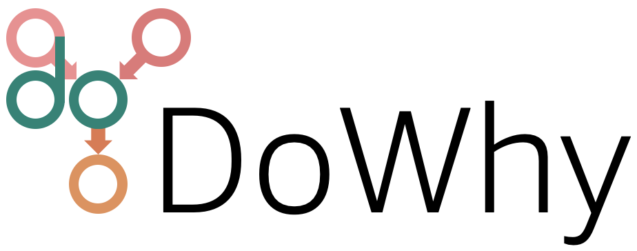

|BuildStatus|_ |PyPiVersion|_ |PythonSupport|_ |Downloads|_ |discord|_ |gurubase|_

.. |PyPiVersion| image:: https://img.shields.io/pypi/v/dowhy.svg
.. _PyPiVersion: https://pypi.org/project/dowhy/

.. |PythonSupport| image:: https://img.shields.io/pypi/pyversions/dowhy.svg
.. _PythonSupport: https://pypi.org/project/dowhy/

.. |BuildStatus| image:: https://github.com/py-why/dowhy/actions/workflows/ci.yml/badge.svg
.. _BuildStatus: https://github.com/py-why/dowhy/actions

.. |Downloads| image:: https://pepy.tech/badge/dowhy
.. _Downloads: https://pepy.tech/project/dowhy

.. |discord| image:: https://img.shields.io/discord/818456847551168542
.. _discord: https://discord.gg/cSBGb3vsZb

.. |gurubase| image:: https://img.shields.io/badge/Gurubase-Ask%20DoWhy%20Guru-006BFF
.. _gurubase: https://gurubase.io/g/dowhy

`Checkout the documentation <https://py-why.github.io/dowhy/>`_
===============================================================

- The documentation, user guide, sample notebooks and other information are available at
    `https://py-why.github.io/dowhy <https://py-why.github.io/dowhy/>`_
- DoWhy is part of the `PyWhy Ecosystem <https://www.pywhy.org/>`_. For more tools and libraries related to causality, checkout the `PyWhy GitHub organization <https://github.com/py-why/>`_!
- For any questions, comments, or discussions about specific use cases, join our community on `Discord <https://discord.gg/cSBGb3vsZb>`_ (|discord|_)
- Jump right into some case studies:
    - Effect estimation: `Hotel booking cancellations <https://medium.com/data-science/beyond-predictive-models-the-causal-story-behind-hotel-booking-cancellations-d29e8558cbaf>`_ | `Effect of customer loyalty programs <https://www.pywhy.org/dowhy/main/example_notebooks/dowhy_example_effect_of_memberrewards_program.html>`_ | `Optimizing article headlines <https://medium.com/@akelleh/introducing-the-do-sampler-for-causal-inference-a3296ea9e78d>`_ | `Effect of home visits on infant health (IHDP) <https://medium.com/data-science/implementing-causal-inference-a-key-step-towards-agi-de2cde8ea599>`_ | `Causes of customer churn/attrition <https://medium.com/geekculture/a-quickstart-for-causal-analysis-decision-making-with-dowhy-2ce2d4d1efa9>`_
    - Root cause analysis and explanations: `Causal attribution and root-cause analysis of an online shop <https://www.pywhy.org/dowhy/main/example_notebooks/gcm_online_shop.html>`_ | `Finding the Root Cause of Elevated Latencies in a Microservice Architecture <https://www.pywhy.org/dowhy/main/example_notebooks/gcm_rca_microservice_architecture.html>`_ | `Finding Root Causes of Changes in a Supply Chain <https://www.pywhy.org/dowhy/main/example_notebooks/gcm_supply_chain_dist_change.html>`_

For more example notebooks, see `here! <https://www.pywhy.org/dowhy/main/example_notebooks/nb_index.html>`_

Introduction & Key Features
===========================
Decision-making involves understanding how different variables affect each other and predicting the outcome when some of them are changed to new values. For instance, given an outcome variable, one may be interested in determining how a potential action(s) may affect it, understanding what led to its current value, or simulate what would happen if some variables are changed. Answering such questions requires causal reasoning. DoWhy is a Python library that guides you through the various steps of causal reasoning and provides a unified interface for answering causal questions.

DoWhy provides a wide variety of algorithms for effect estimation, prediction, quantification
of causal influences, diagnosis of causal structures, root cause analysis, interventions and
counterfactuals. A key feature of DoWhy is its refutation and falsification API that can test causal assumptions for any estimation method,
thus making inference more robust and accessible to non-experts.

**Graphical Causal Models and Potential Outcomes: Best of both worlds**

DoWhy builds on two of the most powerful frameworks for causal inference:
graphical causal models and potential outcomes. For effect estimation, it uses graph-based criteria and do-calculus for
modeling assumptions and identifying a non-parametric causal effect. For estimation, it switches to methods based
primarily on potential outcomes.

For causal questions beyond effect estimation, it uses the power of graphical causal models by modeling the data
generation process via explicit causal mechanisms at each node, which, for instance, unlocks capabilities to attribute
observed effects to particular variables or estimate point-wise counterfactuals.

For a quick introduction to causal inference, check out `amit-sharma/causal-inference-tutorial <https://github.com/amit-sharma/causal-inference-tutorial/>`_
We also gave a more comprehensive tutorial at the ACM Knowledge Discovery and Data Mining (`KDD 2018 <http://www.kdd.org/kdd2018/>`_) conference: `causalinference.gitlab.io/kdd-tutorial <http://causalinference.gitlab.io/kdd-tutorial/>`_.
For an introduction to the four steps of causal inference and its implications for machine learning, you can access this video tutorial from Microsoft Research `DoWhy Webinar <https://www.microsoft.com/en-us/research/video/foundations-of-causal-inference-and-its-impacts-on-machine-learning/>`_ and for an introduction to the graphical causal model API, see the `PyCon presentation on Root Cause Analysis with DoWhy <https://www.youtube.com/watch?v=icpHrbDlGaw>`_.

Key Features
~~~~~~~~~~~~

.. image:: https://raw.githubusercontent.com/py-why/dowhy/main/docs/images/dowhy-features.png

DoWhy supports the following causal tasks:

- Effect estimation (identification, average causal effect, conditional average causal effect, instrumental variables and more)
- Quantify causal influences (mediation analysis, direct arrow strength, intrinsic causal influence)
- What-if analysis (generate samples from interventional distribution, estimate counterfactuals)
- Root cause analysis and explanations (attribute anomalies to their causes, find causes for changes in distributions, estimate feature relevance and more)

For more details and how to use these methods in practice, checkout the documentation at `https://py-why.github.io/dowhy <https://py-why.github.io/dowhy/>`_

Quick Start
===========
DoWhy support Python 3.8+. To install, you can use pip, poetry, or conda.

**Latest Release**

Install the latest `release <https://pypi.org/project/dowhy/>`__ using pip.

.. code:: shell

   pip install dowhy

Install the latest `release <https://pypi.org/project/dowhy/>`__ using poetry.

.. code:: shell

   poetry add dowhy

Install the latest `release <https://anaconda.org/conda-forge/dowhy>`__ using conda.

.. code:: shell

   conda install -c conda-forge dowhy

If you face "Solving environment" problems with conda, then try :code:`conda update --all` and then install dowhy. If that does not work, then use :code:`conda config --set channel_priority false` and try to install again. If the problem persists, please `add your issue here <https://github.com/microsoft/dowhy/issues/197>`_.

**Development Version**

If you prefer to use the latest dev version, your dependency management tool will need to point at our GitHub repository.

.. code:: shell

    pip install git+https://github.com/py-why/dowhy@main

**Requirements**

DoWhy requires a few dependencies. 
Details on specific versions can be found in `pyproject.toml <./pyproject.toml>`_, under the `tool.poetry.dependencies` section.

If you face any problems, try installing dependencies manually.

.. code:: shell

    pip install '<dependency-name>==<version>'

Optionally, if you wish to input graphs in the dot format, then install pydot (or pygraphviz).

For better-looking graphs, you can optionally install pygraphviz. To proceed,
first install graphviz and then pygraphviz (on Ubuntu and Ubuntu WSL).

.. note::
    Installing pygraphviz can cause problems on some platforms.
    One way that works for most Linux distributions is to
    first install graphviz and then pygraphviz as shown below.
    Otherwise, please consult the documentation of `pygraphviz <https://pygraphviz.github.io/documentation/stable/install.html>`_.

.. code:: shell

    sudo apt install graphviz libgraphviz-dev graphviz-dev pkg-config
    pip install --global-option=build_ext \
    --global-option="-I/usr/local/include/graphviz/" \
    --global-option="-L/usr/local/lib/graphviz" pygraphviz

Example: Effect identification and estimation
~~~~~~~~~~~~~~~~~~~~~~~~~~~~~~~~~~~~~~~~~~~~~
Most causal tasks in DoWhy only require a few lines of code to write. Here, we exemplarily estimate the causal effect of
a treatment on an outcome variable:

.. code:: python

    from dowhy import CausalModel
    import dowhy.datasets

    # Load some sample data
    data = dowhy.datasets.linear_dataset(
        beta=10,
        num_common_causes=5,
        num_instruments=2,
        num_samples=10000,
        treatment_is_binary=True)

A causal graph can be defined in different way, but the most common way is via `NetworkX <https://networkx.org/>`_.
After loading in the data, we use the four main operations for effect estimation in DoWhy: *model*, *identify*,
*estimate* and *refute*:

.. code:: python

    # I. Create a causal model from the data and given graph.
    model = CausalModel(
        data=data["df"],
        treatment=data["treatment_name"],
        outcome=data["outcome_name"],
        graph=data["gml_graph"])  # Or alternatively, as nx.DiGraph

    # II. Identify causal effect and return target estimands
    identified_estimand = model.identify_effect()

    # III. Estimate the target estimand using a statistical method.
    estimate = model.estimate_effect(identified_estimand,
                                     method_name="backdoor.propensity_score_matching")

    # IV. Refute the obtained estimate using multiple robustness checks.
    refute_results = model.refute_estimate(identified_estimand, estimate,
                                           method_name="random_common_cause")

DoWhy stresses on the interpretability of its output. At any point in the analysis,
you can inspect the untested assumptions, identified estimands (if any), and the
estimate (if any). Here's a sample output of the linear regression estimator:

.. image:: https://raw.githubusercontent.com/py-why/dowhy/main/docs/images/regression_output.png
    :width: 80%

For a full code example, check out the `Getting Started with DoWhy <https://www.pywhy.org/dowhy/main/example_notebooks/dowhy_simple_example.html>`_ notebook.

You can also use Conditional Average Treatment Effect (CATE) estimation methods from `EconML <https://github.com/py-why/econml>`_, as shown in the `Conditional Treatment Effects <https://www.pywhy.org/dowhy/main/example_notebooks/dowhy-conditional-treatment-effects.html>`_ notebook. Here's a code snippet.

.. code:: python

	from sklearn.preprocessing import PolynomialFeatures
	from sklearn.linear_model import LassoCV
	from sklearn.ensemble import GradientBoostingRegressor
	dml_estimate = model.estimate_effect(identified_estimand, method_name="backdoor.econml.dml.DML",
                        control_value = 0,
                        treatment_value = 1,
                        target_units = lambda df: df["X0"]>1,
                        confidence_intervals=False,
                        method_params={
                            "init_params":{'model_y':GradientBoostingRegressor(),
                                           'model_t': GradientBoostingRegressor(),
                                           'model_final':LassoCV(),
                                           'featurizer':PolynomialFeatures(degree=1, include_bias=True)},
                            "fit_params":{}})

Example: Graphical causal model (GCM) based inference
~~~~~~~~~~~~~~~~~~~~~~~~~~~~~~~~~~~~~~~~~~~~~~~~~~~~~
DoWhy's graphical causal model framework offers powerful tools to address causal questions beyond effect estimation.
It is based on Pearl's graphical causal model framework and models the causal data generation process of each variable
explicitly via *causal mechanisms* to support a wide range of causal algorithms. For more details, see the book
`Elements of Causal Inference <https://mitpress.mit.edu/9780262037310/elements-of-causal-inference/>`_.

Complex causal queries, such as attributing observed anomalies to nodes in the system, can be performed with just a few
lines of code:

.. code:: python

    import networkx as nx, numpy as np, pandas as pd
    from dowhy import gcm

    # Let's generate some "normal" data we assume we're given from our problem domain:
    X = np.random.normal(loc=0, scale=1, size=1000)
    Y = 2 * X + np.random.normal(loc=0, scale=1, size=1000)
    Z = 3 * Y + np.random.normal(loc=0, scale=1, size=1000)
    data = pd.DataFrame(dict(X=X, Y=Y, Z=Z))

    # 1. Modeling cause-effect relationships as a structural causal model
    #    (causal graph + functional causal models):
    causal_model = gcm.StructuralCausalModel(nx.DiGraph([('X', 'Y'), ('Y', 'Z')]))  # X -> Y -> Z
    gcm.auto.assign_causal_mechanisms(causal_model, data)

    # 2. Fitting the SCM to the data:
    gcm.fit(causal_model, data)

    # Optional: Evaluate causal model
    print(gcm.evaluate_causal_model(causal_model, data))

    # Step 3: Perform a causal analysis.
    # results = gcm.<causal_query>(causal_model, ...)
    # For instance, root cause analysis:
    anomalous_sample = pd.DataFrame(dict(X=[0.1], Y=[6.2], Z=[19]))  # Here, Y is the root cause.

    # "Which node is the root cause of the anomaly in Z?":
    anomaly_attribution = gcm.attribute_anomalies(causal_model, "Z", anomalous_sample)

    # Or sampling from an interventional distribution. Here, under the intervention do(Y := 2).
    samples = gcm.interventional_samples(causal_model, interventions={'Y': lambda y: 2}, num_samples_to_draw=100)

The GCM framework offers many more features beyond these examples. For a full code example, check out the `Online Shop example notebook <https://www.pywhy.org/dowhy/main/example_notebooks/gcm_online_shop.html>`_.

For more functionalities, example applications of DoWhy and details about the outputs, see the `User Guide <https://www.pywhy.org/dowhy/main/user_guide/intro.html>`_ or
checkout `Jupyter notebooks <https://www.pywhy.org/dowhy/main/example_notebooks/nb_index.html>`_.

More Information & Resources
============================
`Microsoft Research Blog <https://www.microsoft.com/en-us/research/blog/dowhy-a-library-for-causal-inference/>`_ | `Video Tutorial for Effect Estimation <https://www.youtube.com/watch?v=LALfQStONEc&t=114s>`_ | `Video Tutorial for Root Cause Analysis <https://www.youtube.com/watch?v=icpHrbDlGaw>`_ | `Arxiv Paper <https://arxiv.org/abs/2011.04216>`_ | `Arxiv Paper (Graphical Causal Model extension) <https://arxiv.org/abs/2206.06821>`_ | `Slides <https://www2.slideshare.net/AmitSharma315/dowhy-an-endtoend-library-for-causal-inference>`_

Citing this package
~~~~~~~~~~~~~~~~~~~
If you find DoWhy useful for your work, please cite **both** of the following two references:

- Amit Sharma, Emre Kiciman. DoWhy: An End-to-End Library for Causal Inference. 2020. https://arxiv.org/abs/2011.04216
- Patrick Blöbaum, Peter Götz, Kailash Budhathoki, Atalanti A. Mastakouri, Dominik Janzing. DoWhy-GCM: An extension of DoWhy for causal inference in graphical causal models. 2024. MLOSS 25(147):1−7. https://jmlr.org/papers/v25/22-1258.html

Bibtex::

  @article{dowhy,
    title={DoWhy: An End-to-End Library for Causal Inference},
    author={Sharma, Amit and Kiciman, Emre},
    journal={arXiv preprint arXiv:2011.04216},
    year={2020}
  }

  @article{JMLR:v25:22-1258,
  author  = {Patrick Bl{{\"o}}baum and Peter G{{\"o}}tz and Kailash Budhathoki and Atalanti A. Mastakouri and Dominik Janzing},
  title   = {DoWhy-GCM: An Extension of DoWhy for Causal Inference in Graphical Causal Models},
  journal = {Journal of Machine Learning Research},
  year    = {2024},
  volume  = {25},
  number  = {147},
  pages   = {1--7},
  url     = {http://jmlr.org/papers/v25/22-1258.html}
  }

Issues
~~~~~~
If you encounter an issue or have a specific request for DoWhy, please `raise an issue <https://github.com/py-why/dowhy/issues>`_.

Contributing
~~~~~~~~~~~~

This project welcomes contributions and suggestions. For a guide to contributing and a list of all contributors, check out `CONTRIBUTING.md <https://github.com/py-why/dowhy/blob/main/CONTRIBUTING.md>`_ and our `docs for contributing code <https://github.com/py-why/dowhy/blob/main/docs/source/contributing/contributing-code.rst>`_. Our `contributor code of conduct is available here <https://github.com/py-why/governance/blob/main/CODE-OF-CONDUCT.md>`_.
