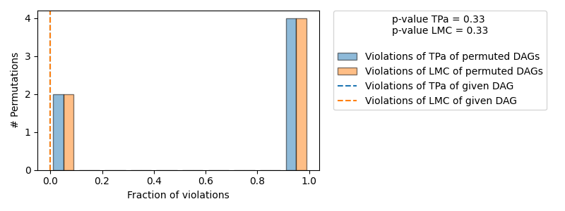

Generate samples from a GCM
===========================

A graphical causal model (GCM) describes the data generation process of the modeled variables. Therefore, after we fit
a GCM, we can also generate completely new samples from it and, thus, can see it as data generator for synthetic data based on the underlying
models. Generating new samples can generally be done by sorting the nodes in topological
order, randomly sample from root-nodes and then propagate the data through the graph by evaluating the downstream
causal mechanisms with randomly sampled noise. The ``dowhy.gcm`` package provides a simple helper function that does
this automatically and, by this, offers a simple API to draw samples from a GCM.

Lets take a look at the following example:

>>> import numpy as np, pandas as pd
>>>
>>> X = np.random.normal(loc=0, scale=1, size=1000)
>>> Y = 2 * X + np.random.normal(loc=0, scale=1, size=1000)
>>> Z = 3 * Y + np.random.normal(loc=0, scale=1, size=1000)
>>> data = pd.DataFrame(data=dict(X=X, Y=Y, Z=Z))
>>> data.head()
          X         Y          Z
0  0.690159  0.619753   1.447241
1 -0.371759 -0.091857  -0.102173
2 -1.555987 -3.103839 -10.888229
3 -1.540165 -3.196612  -9.028178
4  1.218309  3.867429  12.394407

We now learned the generative models of the variables, based on the defined causal graph and the additive noise model assumption.
To generate new samples from this model, we can now simply call:

>>> import networkx as nx
>>> import dowhy.gcm as gcm
>>>
>>> causal_model = gcm.StructuralCausalModel(nx.DiGraph([('X', 'Y'), ('Y', 'Z')]))
>>> gcm.auto.assign_causal_mechanisms(causal_model, data) # Automatically assigns additive noise models to non-root nodes
>>> gcm.fit(causal_model, data)

We now learned the generative models of the variables, based on the defined causal graph and the additive noise model assumption.
To generate new samples from this model, we can now simply call:

>>> generated_data = gcm.draw_samples(causal_model, num_samples=1000)
>>> generated_data.head()
          X         Y          Z
0 -0.322038 -0.693841  -2.319015
1 -0.526893 -2.058297  -6.935897
2 -1.591554 -4.199653 -12.588653
3 -0.817718 -1.125724  -3.013189
4  0.520793 -0.081344   0.987426

If our modeling assumptions are correct, the generated data should now resemble the observed data distribution, i.e.
the generated samples correspond to the joint distribution we defined for our example data at the beginning. One way
to make sure of this is to estimate the KL-divergence between observed and generated distribution. For this, we can
make use of the evaluation module:

>>> print(gcm.evaluate_causal_model(causal_model, data, evaluate_causal_mechanisms=False, evaluate_invertibility_assumptions=False))

.. code-block::

    Evaluated and the overall average KL divergence between generated and observed distribution and graph structure. The results are as follows:

    ==== Evaluation of Generated Distribution ====
    The overall average KL divergence between the generated and observed distribution is 0.014769479715506385
    The estimated KL divergence indicates an overall very good representation of the data distribution.

    ==== Evaluation of the Causal Graph Structure ====
    +-------------------------------------------------------------------------------------------------------+
    |                                         Falsification Summary                                          |
    +-------------------------------------------------------------------------------------------------------+
    | The given DAG is not informative because 2 / 6 of the permutations lie in the Markov                  |
    | equivalence class of the given DAG (p-value: 0.33).                                                   |
    | The given DAG violates 0/1 LMCs and is better than 66.7% of the permuted DAGs (p-value: 0.33).        |
    | Based on the provided significance level (0.2) and because the DAG is not informative,               |
    | we do not reject the DAG.                                                                             |
    +-------------------------------------------------------------------------------------------------------+

    ==== NOTE ====
    Always double check the made model assumptions with respect to the graph structure and choice of causal mechanisms.
    All these evaluations give some insight into the goodness of the causal model, but should not be overinterpreted, since some causal relationships can be intrinsically hard to model. Furthermore, many algorithms are fairly robust against misspecifications or poor performances of causal mechanisms.

This confirms that the generated distribution is close to the observed one.

.. note::

    While the evaluation provides us insights toward the causal graph structure as well, we cannot confirm the
    graph structure, only reject it if we find inconsistencies between the dependencies of the observed structure and what
    the graph represents. In our case, we do not reject the DAG, but there are other equivalent DAGs that would not be
    rejected as well. To see this, consider the example above - X→Y→Z and X←Y←Z would generate the same observational
    distribution (since they encode the same conditionals), but only X→Y→Z would generate the correct interventional
    distribution (e.g., when intervening on Y).

The next section provides more details about the evaluation method.