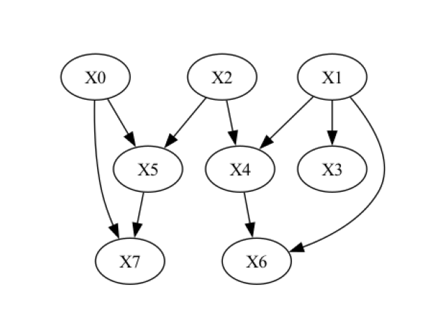

Generating random SCMs for benchmarking
=======================================

When developing or evaluating causal methods, we often need data where the ground truth is known: the causal graph,
the mechanisms and the noise. Real data rarely comes with this information, and hand-written toy models tend to be
too simple to be representative. The ``dowhy.gcm.data_generator`` module fills this gap. It generates random
structural causal models (SCMs) of arbitrary size whose mechanisms cover a wide range of realistic behaviour, and it
returns them as regular :class:`~dowhy.gcm.causal_models.StructuralCausalModel` objects, so everything described in the
previous sections (drawing samples, interventions, counterfactuals, fitting, evaluation) works on them out of the box.

Typical uses are benchmarking causal discovery or effect estimation algorithms across many random ground truths,
stress-testing a pipeline against non-Gaussian, heteroscedastic or discretised data, and generating synthetic
datasets for tutorials and unit tests.

Generating a random SCM and drawing data from it
------------------------------------------------

To generate a random SCM, we only need to say how many root nodes (variables without parents) and how many non-root
nodes the graph should have:

>>> from dowhy import gcm
>>> from dowhy.gcm.data_generator import generate_random_scm
>>>
>>> gcm.util.general.set_random_seed(0)
>>> scm = generate_random_scm(num_roots=3, num_children=5)

The result is a regular, already fitted :class:`~dowhy.gcm.causal_models.StructuralCausalModel`. Synthetic data is
therefore drawn exactly as from any other GCM, with :func:`~dowhy.gcm.draw_samples`:

>>> samples = gcm.draw_samples(scm, num_samples=1000)
>>> samples.head()
         X0        X1        X2        X3        X5        X4        X6        X7
0 -0.735651  0.000000 -0.101367  0.133837 -0.072770  0.037052  1.141605  0.000000
1 -0.616410  1.574406 -0.580365 -0.350869  0.324154 -0.492177  0.607491  0.664010
2  0.065244  0.990212  0.195449  0.918361 -0.541700  0.416879  0.310798  0.177610
3 -0.002475  0.041586 -2.168400  0.775112 -0.138023  0.788844  0.243090  0.139116
4 -1.319146  1.508412  1.050766  0.677219  0.052386  0.317607  0.000000  0.934975

Nodes are named ``X0, X1, ...``; the first ``num_roots`` of them are roots. The columns are returned in topological
order. Note the exact zeros in ``X1``, ``X6`` and ``X7``: these nodes were censored, one of the output transforms the
generator applies at random (more on this below). The generator draws everything from the global random state, so
calling :func:`~dowhy.gcm.util.general.set_random_seed` first makes the graph, the mechanisms and the samples
reproducible.

If only the data is of interest, :func:`~dowhy.gcm.data_generator.generate_samples_from_random_scm` performs both
steps in one call:

>>> from dowhy.gcm.data_generator import generate_samples_from_random_scm
>>>
>>> samples = generate_samples_from_random_scm(num_roots=3, num_children=5, num_samples=1000)

Working with the generated SCM
------------------------------

Having the model itself lets us compare an algorithm's output with the true graph, inspect the mechanisms or run
interventions. Let's look at the graph of the SCM generated above:

>>> import networkx as nx
>>> from dowhy.utils import plot
>>>
>>> plot(scm.graph)

>>> list(scm.graph.edges)
[('X0', 'X5'), ('X1', 'X6'), ('X2', 'X3'), ('X2', 'X4'), ('X2', 'X5'), ('X3', 'X4'), ('X3', 'X6'), ('X3', 'X7'), ('X6', 'X7')]

Each node carries a causal mechanism that we can inspect like in any other GCM:

>>> for node in nx.topological_sort(scm.graph):
>>>     print(node, type(scm.causal_mechanism(node)).__name__)
X0 _GaussianMixtureDistribution
X1 _TransformedStochasticModel
X2 ScipyDistribution
X3 _NonAdditiveNoiseFCM
X5 AdditiveNoiseModel
X4 AdditiveNoiseModel
X6 _TransformedConditionalModel
X7 _TransformedConditionalModel

Every function of the ``gcm`` package that accepts a fitted model works as usual. For instance, drawing a larger
sample to look at the marginal distributions:

>>> data = gcm.draw_samples(scm, num_samples=2000)
>>> data.describe().loc[["mean", "std", "min", "max"]].round(3)
         X0     X1     X2     X3     X5     X4     X6     X7
mean  0.017  0.849  0.023  0.372 -0.043  0.178  0.510  0.542
std   0.985  0.858  0.997  0.574  0.704  0.649  0.540  0.436
min  -3.211  0.000 -2.839 -1.083 -2.047 -1.900  0.000  0.000
max   3.732  2.548  2.760  1.470  2.028  2.964  2.768  1.894

All values stay on a comparable scale: root nodes are standardised to unit variance and every mechanism output is
calibrated to a target range, so values neither explode nor collapse as they propagate through deep graphs.

Because we hold the complete ground-truth SCM and not just a data set, we can also query it for *interventional*
distributions, something observational data alone can never provide. Fixing ``X3`` to -1 changes its descendants
``X4``, ``X6`` and ``X7`` (compare the graph above), while ``X0``, ``X1``, ``X2`` and ``X5`` keep their observational
distribution:

>>> import pandas as pd
>>>
>>> gcm.util.general.set_random_seed(1)
>>> observational = gcm.draw_samples(scm, num_samples=2000)
>>> gcm.util.general.set_random_seed(1)
>>> intervened = gcm.interventional_samples(scm, {"X3": lambda x: -1.0}, num_samples_to_draw=2000)
>>> pd.DataFrame({"observational": observational.mean(), "do(X3 := -1)": intervened.mean()}).round(3).T
                  X0     X1     X2    X3    X5     X4     X6     X7
observational -0.028  0.884  0.032  0.36 -0.07  0.155  0.487  0.558
do(X3 := -1)  -0.028  0.884  0.032 -1.00 -0.07 -1.079  0.832  0.880

This is the true interventional distribution of the data-generating process, which makes generated SCMs a convenient
ground truth for evaluating effect estimation methods.

What the generator produces
---------------------------

The generator randomises every ingredient of an SCM. With the default configuration:

- **Graph**: Nodes are added in topological order and each new node picks its parents among the preceding nodes. The
  number of parents is controlled by ``edge_density`` (0 gives a tree, 1 the densest possible DAG). The graph is
  always weakly connected, and no root is left without children.
- **Root distributions**: Gaussian, uniform, Laplace, log-normal, exponential, beta, Student-t and chi-squared
  distributions, all standardised to zero mean and unit variance, plus multi-modal Gaussian mixtures.
- **Mechanisms of non-root nodes**: Recall that a non-root node follows :math:`X_i = f_i(PA_{X_i}, N_i)` with
  parents :math:`PA_{X_i}` and independent noise :math:`N_i`. The generator draws :math:`f_i` at random. For most
  nodes it is an *additive noise model* :math:`X_i = f_i(PA_{X_i}) + N_i`, where :math:`f_i` is either a linear
  function or a randomly initialised multilayer perceptron (MLP) with ``tanh`` activations, whose spectral-normalised
  weights produce smooth but clearly nonlinear, non-monotonic relations. Variants of the additive model make the
  noise level depend on the parents (heteroscedastic noise, :math:`X_i = f_i(PA_{X_i}) + g_i(PA_{X_i}) \cdot N_i`) or
  operate in log space (:math:`X_i = \exp(f_i(\log PA_{X_i}) + N_i)`, i.e. positive, right-skewed, multiplicative
  relations).
- **Arbitrary functional causal models**: For a share of the nodes (20% by default, ``prob_non_additive_noise``),
  the generator does not assume any particular noise structure. Instead, the noise is fed into a random MLP together
  with the parents, :math:`X_i = \mathrm{MLP}_i(PA_{X_i}, N_i)`, which mimics an arbitrary FCM of the general form
  :math:`f_i(PA_{X_i}, N_i)`: the noise interacts with the parents in a nonlinear way and cannot be separated from
  them. Such nodes are not invertible, which is exactly the situation many real-world variables are in.
- **Noise distributions**: Gaussian, Laplace, uniform, Student-t or Gaussian mixtures, each with an exactly controlled
  standard deviation. Inputs of every mechanism are standardised and outputs calibrated, so a mechanism behaves the
  same regardless of the scale of its parents.
- **Output transforms**: a node's values can be censored (a controlled fraction becomes exactly zero, like a detection
  limit or zero-inflated counts) or discretised into a few equal-frequency categories (for a censored node, the zeros
  form a category of their own). The thresholds are fixed when
  the SCM is built, so a transformed mechanism is still a deterministic function of its parents and noise.

Every edge in the generated graph corresponds to a detectable dependence: linear coefficients are bounded away from
zero and mechanism outputs are calibrated, so there are no "phantom" edges whose parent has no measurable influence.

Configuring the generator
-------------------------

All of the above is controlled through :class:`~dowhy.gcm.data_generator.DataGeneratorConfig`. Its fields are
probabilities for the different mechanism, noise and transform types, ranges for the random parameters, and weight
dictionaries for the distribution families. Invalid combinations (for instance probabilities that sum to more than
one) raise a ``ValueError`` at construction time. The complete list of options and their defaults:

**Graph structure**

.. list-table::
   :header-rows: 1
   :widths: 30 20 50

   * - Option
     - Default
     - Controls
   * - ``edge_density``
     - ``0.2``
     - How many parents a non-root node gets: 0 gives exactly one parent (a tree), 1 connects every node to all of
       its predecessors (the densest DAG).
   * - ``edge_density_mode``
     - ``"preceding"``
     - How ``edge_density`` is turned into a parent count. ``"preceding"``: a fraction of the node's preceding nodes,
       so later nodes get more parents. ``"total"``: the same expected in-degree ``1 + edge_density * (N - 2)`` for
       every node.

**Causal mechanisms of non-root nodes**

.. list-table::
   :header-rows: 1
   :widths: 30 20 50

   * - Option
     - Default
     - Controls
   * - ``prob_linear_mechanism``
     - ``0.2``
     - Share of non-root nodes with a linear function :math:`f_i`.
   * - ``prob_non_additive_noise``
     - ``0.2``
     - Share of non-root nodes modelled by a random MLP over parents *and* noise, :math:`X_i = \mathrm{MLP}_i(PA_{X_i},
       N_i)`. The remaining ``1 - prob_linear_mechanism - prob_non_additive_noise`` share uses an MLP with additive
       noise. The two probabilities must not sum to more than 1.
   * - ``prob_heteroscedastic_noise``
     - ``0.2``
     - Share of the additive (linear or MLP) nodes whose noise level depends on the parents,
       :math:`X_i = f_i(PA_{X_i}) + (|g_i(PA_{X_i})| + 0.1) \cdot N_i` with a second random MLP :math:`g_i`.
   * - ``prob_log_space_mechanism``
     - ``0.1``
     - Share of the additive nodes that operate in log space, :math:`X_i = \exp(f_i(\log PA_{X_i}) + N_i)`:
       positive, right-skewed, multiplicative relations. Together with ``prob_heteroscedastic_noise`` at most 1.
   * - ``linear_coefficient_range``
     - ``(0.25, 1.0)``
     - Absolute value of the coefficients of linear mechanisms (signs are random). They act on standardised parents,
       and a minimum above 0 keeps every edge detectable.
   * - ``nn_hidden_units_range``
     - ``(4, 64)``
     - Number of hidden units per MLP layer. Wider layers give more expressive nonlinearities.
   * - ``nn_hidden_layers_range``
     - ``(2, 4)``
     - Number of hidden layers. More layers compose more nonlinearities.
   * - ``nn_weight_scale``
     - ``5.0``
     - Scale of the spectral-normalised hidden weights. Higher values push ``tanh`` further into saturation, i.e.
       stronger nonlinearity.
   * - ``nn_output_value_range``
     - ``(-1.0, 1.0)``
     - Target range of every mechanism output (linear and MLP): the 1st and 99th percentiles of the output during
       calibration are mapped onto it, which keeps values bounded in deep graphs.

**Noise distributions**

.. list-table::
   :header-rows: 1
   :widths: 30 20 50

   * - Option
     - Default
     - Controls
   * - ``prob_unimodal_noise``
     - ``0.5``
     - Share of noise terms with a unimodal distribution; the rest are Gaussian mixtures (multi-modal noise).
   * - ``unimodal_noise_weights``
     - gaussian 0.35, laplace 0.25, uniform 0.2, student_t 0.2
     - Relative weights of the unimodal noise families ``gaussian``, ``uniform``, ``laplace``, ``student_t`` and
       ``cauchy`` (heavy tails clipped at 50 standard deviations; not in the default mix).
   * - ``noise_std_range``
     - ``(0.01, 0.5)``
     - Range the standard deviation of each noise term is drawn from, for all families and mixtures. Low values give
       nearly deterministic relations, high values noisy ones.
   * - ``noise_std_log_uniform``
     - ``False``
     - Draw the standard deviation log-uniformly (equal weight per order of magnitude) instead of uniformly.
   * - ``noise_mixture_components_range``
     - ``(2, 6)``
     - Number of Gaussian components in mixture noise and mixture root distributions.
   * - ``noise_mixture_mean_range``
     - ``3.0``
     - Component means are drawn from ``U(-r, r)`` before the mixture is standardised.
   * - ``noise_mixture_component_std``
     - ``0.4``
     - Standard deviation of each component before standardisation. Only the ratio to ``noise_mixture_mean_range``
       matters: small ratios give clearly separated modes, large ratios a single blurred bump.

**Root-node distributions**

.. list-table::
   :header-rows: 1
   :widths: 30 20 50

   * - Option
     - Default
     - Controls
   * - ``prob_unimodal_root``
     - ``0.4``
     - Share of root nodes with a unimodal distribution; the rest are Gaussian mixtures.
   * - ``root_distribution_weights``
     - gaussian 0.25, uniform 0.15, laplace 0.1, lognormal 0.15, exponential 0.1, beta 0.1, student_t 0.05, chi2 0.1
     - Relative weights of the unimodal root families. Every family is standardised to zero mean and unit variance,
       so they differ in skew and tails but not in scale.

**Output transforms (per node)**

.. list-table::
   :header-rows: 1
   :widths: 30 20 50

   * - Option
     - Default
     - Controls
   * - ``prob_clipped_positive``
     - ``0.15``
     - Share of nodes censored from below: values under a per-node threshold become exactly 0, the rest is shifted so
       that all values are non-negative (detection limits, zero-inflated data).
   * - ``prob_clipped_negative``
     - ``0.05``
     - Mirror image, all values non-positive. Together with ``prob_clipped_positive`` at most 1.
   * - ``clip_zero_fraction_range``
     - ``(0.1, 0.4)``
     - Fraction of a censored node's values that are exactly 0; the threshold is the matching quantile, fixed when the
       SCM is built.
   * - ``prob_discretised``
     - ``0.05``
     - Share of nodes whose values are mapped to equal-frequency categories ``0, 1, ..., bins - 1`` with bin edges
       fixed when the SCM is built. For a censored node, the exact zeros form their own category and the remaining
       categories split the non-zero values equally.
   * - ``discrete_num_bins_range``
     - ``(2, 8)``
     - Number of categories for discretised nodes.

**Internal**

.. list-table::
   :header-rows: 1
   :widths: 30 20 50

   * - Option
     - Default
     - Controls
   * - ``num_calibration_samples``
     - ``1000``
     - Number of samples drawn while building the SCM to calibrate each mechanism (input standardisation, output
       range, censoring thresholds, bin edges). More samples give more stable calibration at the cost of speed.

Here are a few common recipes.

A dense graph with only nonlinear mechanisms, heteroscedastic noise on a third of the nodes and low noise overall:

>>> from dowhy.gcm.data_generator import DataGeneratorConfig
>>>
>>> config = DataGeneratorConfig(
...     edge_density=0.5,                         # denser graph (more parents per node)
...     edge_density_mode="total",                # in-degree independent of a node's position
...     prob_linear_mechanism=0.0,                # all nonlinear mechanisms
...     prob_non_additive_noise=0.5,              # half of the nodes have non-additive noise
...     prob_heteroscedastic_noise=0.3,           # 30% of additive nodes: noise scale depends on the parents
...     prob_log_space_mechanism=0.0,             # no multiplicative (log-space) mechanisms
...     noise_std_range=(0.01, 0.05),             # low noise for cleaner relationships
...     unimodal_noise_weights={"gaussian": 0.5, "laplace": 0.5},
...     root_distribution_weights={"gaussian": 0.5, "lognormal": 0.5},
... )
>>> samples = generate_samples_from_random_scm(5, 10, 2000, config=config)

A very common setting in the causal inference literature is to assume additive noise models (ANMs) for all nodes,
:math:`X_i = f_i(PA_{X_i}) + N_i`, with arbitrary nonlinear :math:`f_i`. This keeps every mechanism invertible (the
noise can be recovered as the residual), which many algorithms for counterfactuals, root cause analysis or
independence-based causal discovery rely on. The following configuration generates such SCMs with a mix of linear and
MLP functions and diverse but homoscedastic noise, while keeping the rest of the defaults:

>>> additive_noise = DataGeneratorConfig(
...     prob_non_additive_noise=0.0,              # no X_i = MLP(PA_i, N_i) nodes
...     prob_heteroscedastic_noise=0.0,           # noise level does not depend on the parents
...     prob_log_space_mechanism=0.0,             # no multiplicative (log-space) mechanisms
...     prob_clipped_positive=0.0,                # no censoring ...
...     prob_clipped_negative=0.0,
...     prob_discretised=0.0,                     # ... and no discretisation, so every node stays a plain ANM
... )

The classic linear-Gaussian benchmark setting:

>>> linear_gaussian = DataGeneratorConfig(
...     prob_linear_mechanism=1.0,
...     prob_non_additive_noise=0.0,
...     prob_heteroscedastic_noise=0.0,
...     prob_log_space_mechanism=0.0,
...     prob_unimodal_noise=1.0,
...     unimodal_noise_weights={"gaussian": 1.0},
...     prob_unimodal_root=1.0,
...     root_distribution_weights={"gaussian": 1.0},
...     prob_clipped_positive=0.0,
...     prob_clipped_negative=0.0,
...     prob_discretised=0.0,
... )

A hard setting with heavy tails, skewed roots and many discrete or censored variables:

>>> messy = DataGeneratorConfig(
...     unimodal_noise_weights={"student_t": 0.5, "laplace": 0.3, "cauchy": 0.2},
...     root_distribution_weights={"lognormal": 0.4, "chi2": 0.3, "exponential": 0.3},
...     prob_clipped_positive=0.3,
...     prob_discretised=0.3,
...     discrete_num_bins_range=(2, 4),
...     noise_std_log_uniform=True,               # equal weight to every order of magnitude of the noise level
... )

.. note::

    Only the additive mechanisms (plain, heteroscedastic and log-space) are invertible. Nodes with non-additive noise
    or with an output transform are not, which matters for counterfactuals (see below). To generate an SCM in which
    every node is invertible, set ``prob_non_additive_noise``, ``prob_clipped_positive``, ``prob_clipped_negative``
    and ``prob_discretised`` to zero.

Random mechanisms for your own graph
------------------------------------

If the graph structure is given, for instance because we want to test a method on a specific topology, we can let the
generator fill in only the mechanisms via :func:`~dowhy.gcm.data_generator.assign_random_fcms`:

>>> from dowhy.gcm.data_generator import assign_random_fcms
>>>
>>> gcm.util.general.set_random_seed(0)
>>> causal_model = assign_random_fcms(nx.DiGraph([("age", "income"), ("age", "health"), ("income", "health")]))
>>> gcm.draw_samples(causal_model, num_samples=3).round(4)
      age  income  health
0  1.5299  0.9813 -0.3781
1  0.7664  0.3952 -0.1625
2  1.4792  0.2625 -0.9570

The optional second argument is again a :class:`~dowhy.gcm.data_generator.DataGeneratorConfig`.

Using the SCM as ground truth
-----------------------------

Because the returned object is an ordinary SCM, interventional queries (as shown above) and counterfactual queries
give us the true answers that a method under test should recover.

Counterfactuals require an invertible model. With a configuration that produces only invertible mechanisms, we can
wrap the generated graph in an :class:`~dowhy.gcm.causal_models.InvertibleStructuralCausalModel` (the mechanisms are
stored on the graph, so no refitting is needed):

>>> invertible_config = DataGeneratorConfig(
...     prob_non_additive_noise=0.0, prob_clipped_positive=0.0, prob_clipped_negative=0.0, prob_discretised=0.0
... )
>>> gcm.util.general.set_random_seed(0)
>>> invertible_scm = gcm.InvertibleStructuralCausalModel(generate_random_scm(2, 3, invertible_config).graph)
>>> list(invertible_scm.graph.edges)
[('X0', 'X4'), ('X1', 'X2'), ('X2', 'X3'), ('X2', 'X4')]
>>> observed = gcm.draw_samples(invertible_scm, num_samples=3)
>>> observed.round(4)
       X0      X1      X2      X3      X4
0  1.0254 -0.0790  0.1726  0.8990 -0.5367
1 -0.9072  1.4345  0.9833 -0.9028  0.4520
2 -0.1642  0.0030  0.2693  0.7357 -0.0199
>>> gcm.counterfactual_samples(invertible_scm, {"X0": lambda x: x + 1}, observed_data=observed).round(4)
       X0      X1      X2      X3      X4
0  2.0254 -0.0790  0.1726  0.8990 -0.8432
1  0.0928  1.4345  0.9833 -0.9028 -0.0680
2  0.8358  0.0030  0.2693  0.7357 -0.6332

Only ``X0`` and its child ``X4`` change; the noise of every node is kept exactly as it was in the observed rows.

A typical benchmarking loop generates a random SCM, draws data from it, fits a fresh model on the data using the true
graph (or a graph estimated by a discovery algorithm) and compares the results of a causal query with the ground
truth. For instance, comparing the arrow strengths of the true and the fitted model:

>>> gcm.util.general.set_random_seed(0)
>>> ground_truth = generate_random_scm(2, 4, invertible_config)
>>> data = gcm.draw_samples(ground_truth, num_samples=2000)
>>>
>>> fitted = gcm.StructuralCausalModel(nx.DiGraph(ground_truth.graph.edges))
>>> gcm.auto.assign_causal_mechanisms(fitted, data)
>>> gcm.fit(fitted, data)
>>>
>>> {edge: round(strength, 3) for edge, strength in gcm.arrow_strength(ground_truth, "X4").items()}
{('X0', 'X4'): 0.106, ('X2', 'X4'): 0.139}
>>> {edge: round(strength, 3) for edge, strength in gcm.arrow_strength(fitted, "X4").items()}
{('X0', 'X4'): 0.144, ('X2', 'X4'): 0.147}

Repeating this over many seeds and configurations gives a robust picture of how a method behaves across graph
densities, mechanism types and noise levels.

.. note::

    Generated SCMs can be cloned with ``scm.clone()`` and refitted with :func:`~dowhy.gcm.fit`; the clone keeps all
    random weights and thresholds, so ``draw_samples`` on the clone reproduces the original model under the same seed.
